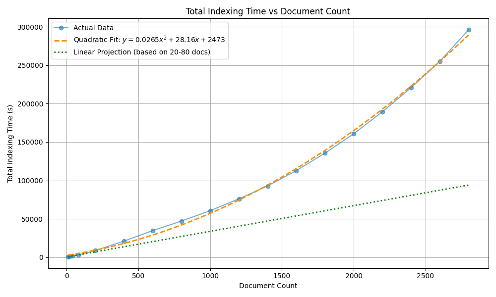

# HippoRAG Scaling Test

This project investigates the scaling performance of [HippoRAG](https://github.com/OSU-NLP-Group/HippoRAG), specifically focusing on how indexing and retrieval times grow as the number of documents increases.

## Project Idea
The primary goal is to verify if HippoRAG's indexing process scales linearly or shows signs of non-linear (e.g., quadratic) growth as I expected.

## Experiment Methodology
The experiments were conducted using a subset of the HotpotQA dataset. The process involved:
1. **Incremental Indexing**: Documents were indexed in increasing subsets, ranging from 10 to 4000 documents.
2. **Retrieval Testing**: After each indexing step, 10 retrieval queries were executed to measure the average retrieval time. This was just a side test that did not affect the main experiment or show any conclusive results.
3. **Metrics Recorded**:
   - Cumulative indexing time (seconds)
   - Average retrieval time (seconds)
   - Total document count

Experiments utilize **OpenRouter** for both LLM (`meta-llama/llama-3.3-70b-instruct`) and Embeddings (`openai/text-embedding-3-small`), with a custom injection layer to ensure compatibility with the OpenAI client used by HippoRAG.

## Results & Analysis
The plot below shows the relationship between the number of documents and the total indexing time. The data suggests a quadratic growth pattern, which is significantly slower than the ideal linear projection. Note that we got a memory overflow (on 64RAM) during the 2800 - 3000 document phase, showing likely not only the indexing time but also the memory footprint 'explodes'.

*The plot includes a quadratic fit and a linear reference line based on the initial 20-80 document performance.*

I have already created a [Github Issue]([https://github.com/OSU-NLP-Group/HippoRAG/issues/170]) where I describe my initial suspicions and even go into a shallow analysis why this happens. Note though that I have used some 'patches' trying to fix the scaling issue (and though fixing the clear quadratic 'bug' described in the issue may help with performance) it's still quadradic after. I decided to use the vanilla HippoRAG without my patches to not introduce any additional potential error sources and show the pattern clearly.

## Setup & Troubleshooting

### Dependency Issues
> [!IMPORTANT]
> HippoRAG may attempt to install a non-existent version of the OpenAI library (e.g., `openai 1.91.1`). 

To resolve this:
- Use a recent stable version of `openai` (e.g., `1.5` or later).
- You might need to manually adjust imports or use the project's custom `OpenRouterEmbeddingModel` injection found in `src/experiment.py` to fix "NoneType" errors or other compatibility glitches between HippoRAG and the latest OpenAI client.

### Environment
1. Create a virtual environment: `python -m venv venv`
2. Install dependencies: `pip install -r requirements.txt`
3. Configure your API key in `src/models/openrouter.txt` or as an environment variable `OPENROUTER_API_KEY`.

